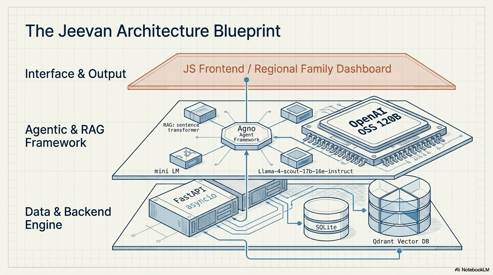
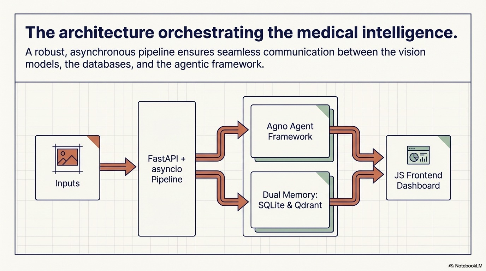

<p align="center">
  
  
  
  
  
  
</p>

<h1 align="center">🏥 Jeevan — AI-Powered ICU & Medical Intelligence Platform</h1>

<p align="center">
  <strong>An end-to-end agentic AI system for medical report extraction, clinical reasoning, sepsis risk detection, and family-friendly health communication — powered by multi-agent orchestration, RAG, and vision AI.</strong>
</p>

<p align="center">
  <em>Built for the Ignisia Hackathon • April 2026</em>
</p>

---

## 📑 Table of Contents

- [Overview](#-overview)
- [Key Features](#-key-features)
- [Architecture Diagram](#-architecture-diagram)
- [Workflow Diagram](#-workflow-diagram)
- [Tech Stack](#-tech-stack)
- [AI Pipeline Deep Dive](#-ai-pipeline-deep-dive)
- [API Reference](#-api-reference)
- [Setup & Installation](#-setup--installation)
- [Environment Variables](#-environment-variables)
- [RAG Knowledge Base](#-rag-knowledge-base)
- [Database Schema](#-database-schema)
- [Usage Walkthrough](#-usage-walkthrough)
- [Disclaimer](#-disclaimer)

---

## 🔭 Overview

**Jeevan** is a full-stack, AI-driven medical intelligence platform designed for ICU monitoring and early sepsis detection. It transforms raw medical report images into structured, actionable clinical insights through a sophisticated multi-step AI pipeline:

1. **Vision AI** extracts structured data from medical report images  
2. **Multi-agent reasoning** (Agno framework) analyzes trends, abnormalities, and risks  
3. **RAG-augmented validation** enriches findings with clinical guideline citations  
4. **Chief Agent** provides senior-doctor-level risk assessment with temporal analysis  
5. **Family Communication Layer** translates clinical reports into simple, compassionate language — in English and Hindi  

The platform bridges the critical gap between complex medical data and human understanding, serving both clinicians (with data-driven dashboards) and patient families (with jargon-free summaries).

---

## ✨ Key Features

### 🔬 Intelligent Medical Data Extraction
- Upload medical report images (JPG, PNG, WEBP)
- AI-powered extraction using **LLaMA 4 Scout** vision model via Groq
- Automatic extraction of patient info, test names, values, units, reference ranges, dates, lab/doctor details
- Image compression & optimization pipeline for consistent results
- Persistent storage with automatic patient deduplication

### 🧠 Multi-Agent Clinical Reasoning
- **Medical Data Analyst Agent** — identifies abnormalities, trends, and correlations
- **Health Advisor Agent** — generates safe, non-diagnostic lifestyle recommendations
- **Medical Reasoning Team** — coordinated team output with risk-level assessment
- Built on the **Agno** multi-agent framework with GPT-OSS-120B

### 🩺 Chief Agent — Senior ICU Doctor Simulation
- Temporal mapping of all test results across time
- Statistical outlier detection (3σ method) for anomaly flagging
- Disease progression identification and sepsis/organ failure risk detection
- Contextual reasoning with medical guideline citations via RAG

### 📚 RAG (Retrieval-Augmented Generation)
- Indexed medical PDFs: sepsis protocols, early warning scores, organ dysfunction guidelines
- Vector search via **Qdrant** with `sentence-transformers/all-MiniLM-L6-v2` embeddings
- Auto-generated search queries from clinical findings for targeted retrieval
- Final reports cite specific guideline sources for clinical validation

### 👨‍👩‍👧 Family-Friendly Communication
- Rewrites clinical reports in simple, compassionate layman language
- Structured sections: what reports show, things to watch, good signs, next steps, family message
- Uses warm analogies and everyday comparisons (no jargon, no numbers)
- **Multi-language support**: automated translation to Hindi (extensible to other languages)

### 📊 Analytics & Visualization
- Patient chart data API optimized for frontend charting (Chart.js/Recharts)
- Test values grouped by test name with temporal data points
- Numeric value parsing with fallback for non-standard formats
- Combined report generation (timeline + charts + AI analysis)

---

## 🏗 Architecture Diagram

<p align="center">
  
</p>

---

## 🔄 Workflow Diagram

<p align="center">
  
</p>

---

## 🛠 Tech Stack

| Layer | Technology | Purpose |
|-------|-----------|---------|
| **Backend Framework** | FastAPI + Uvicorn | High-performance async REST API |
| **Vision AI** | Groq + LLaMA 4 Scout 17B | Medical report image extraction |
| **Multi-Agent Reasoning** | Agno Framework + GPT-OSS-120B | Clinical data analysis team |
| **Chief Agent LLM** | Groq + GPT-OSS-20B | Senior doctor-level reasoning |
| **RAG Vector DB** | Qdrant (Cloud/Local) | Medical guideline retrieval |
| **Embeddings** | HuggingFace `all-MiniLM-L6-v2` | Semantic document search |
| **Document Processing** | LangChain + PyPDF | PDF loading, splitting, indexing |
| **Database** | SQLite | Patient & test data persistence |
| **Image Processing** | Pillow (PIL) | Image compression, base64 encoding |
| **Frontend** | HTML5 + TailwindCSS + Chart.js | Responsive clinical dashboard |
| **Translation** | Groq LLM | Multi-language family communication |

---

## 🧪 AI Pipeline Deep Dive

### Pipeline 1: Medical Report Extraction (`/extract`)

```
Medical Report Image
        │
        ▼
┌─────────────────┐
│ File Validation  │ ← JPG/PNG/WEBP only
├─────────────────┤
│ Image Compress   │ ← Resize to 1024x1024, JPEG quality 80
├─────────────────┤
│ Base64 Encoding  │
├─────────────────┤
│ Groq Vision API  │ ← LLaMA 4 Scout 17B multimodal
│ (Structured JSON │   Extracts: patient, tests[], timeline,
│  extraction)     │   lab_name, doctor_name
├─────────────────┤
│ JSON Parsing     │ ← Robust extraction from LLM response
├─────────────────┤
│ SQLite Storage   │ ← Auto-deduplicates patients by name
└─────────────────┘
```

### Pipeline 2: Full Clinical Reasoning (`/reason-medical`)

```
Patient Name (input)
        │
        ▼
┌──────────────────────────────────────────────────────────┐
│ Step 1: Fetch all historical tests from SQLite           │
├──────────────────────────────────────────────────────────┤
│ Step 2: Multi-Agent Reasoning (Agno Framework)           │
│   ├─ Medical Data Analyst → abnormalities, trends,       │
│   │                          correlations, data quality  │
│   ├─ Health Advisor → recommendations, risk indicators,  │
│   │                    monitoring suggestions             │
│   └─ Team Lead → consolidated risk assessment            │
├──────────────────────────────────────────────────────────┤
│ Step 3: RAG Augmentation                                 │
│   ├─ Generate targeted search queries from findings      │
│   ├─ Vector search in Qdrant (medical PDFs)              │
│   └─ LLM synthesizes final report with guideline cites   │
├──────────────────────────────────────────────────────────┤
│ Step 4: Family Communication                             │
│   ├─ Rewrite report in simple layman language             │
│   └─ Translate to Hindi                                  │
└──────────────────────────────────────────────────────────┘
        │
        ▼
{
  "reasoning": "Full clinical report (markdown)",
  "family_communication": {
    "english": "Simple family-friendly summary",
    "hindi": "हिंदी में सरल सारांश"
  }
}
```

### Pipeline 3: Chief Agent Report (`/report_explanation`)

```
Patient Name → DB Lookup → Temporal Mapping → Outlier Detection (3σ)
        │
        ▼
RAG Context Retrieval (medical guidelines)
        │
        ▼
Chief Agent LLM Prompt (Senior ICU Doctor role):
  ├─ Disease progression identification
  ├─ Sepsis / organ failure risk assessment
  ├─ Outlier analysis (ignore if inconsistent)
  ├─ Evidence-based reasoning with guideline citations
  └─ Safety disclaimer
```

---

## 📡 API Reference

### Core Endpoints

| Method | Endpoint | Description |
|--------|----------|-------------|
| `POST` | `/extract` | Upload medical report image → AI extraction → store in DB |
| `POST` | `/reason-medical` | Full clinical reasoning pipeline with family communication |
| `GET` | `/patient/{patient_name}/chart-data` | Chart-optimized medical test data |
| `GET` | `/report_explanation?patient_name=X` | Chief Agent clinical report |
| `GET` | `/generate-report?patient_name=X` | Combined timeline + charts + AI report |
| `GET` | `/health` | Service health check |

### `POST /extract`

**Request:** `multipart/form-data` with `file` field (image)

**Response:**
```json
{
  "success": true,
  "data": {
    "patient": { "name": "JOHN DOE", "age": "45", "gender": "Male" },
    "tests": [
      { "name": "Hemoglobin", "value": "12.5", "unit": "g/dL", "reference_range": "13-17", "date": "2026-03-15" }
    ],
    "timeline": ["2026-03-15"],
    "lab_name": "City Diagnostics",
    "doctor_name": "Dr. Smith"
  },
  "message": "Extraction successful and data saved to database!"
}
```

### `POST /reason-medical`

**Request Body:**
```json
{
  "patient_name": "John Doe"
}
```

**Response:**
```json
{
  "success": true,
  "reasoning": "# Final Patient Report\n## Clinical Summary\n...(markdown with guideline citations)...",
  "family_communication": {
    "english": "🏥 What the reports show\nYour loved one's blood tests...",
    "hindi": "🏥 रिपोर्ट क्या दिखाती है\nआपके प्रियजन के रक्त परीक्षण..."
  },
  "message": "Reasoning + family communication generated successfully."
}
```

### `GET /patient/{patient_name}/chart-data`

**Response:**
```json
{
  "success": true,
  "patient": "JOHN DOE",
  "chart_data": {
    "Hemoglobin": {
      "unit": "g/dL",
      "reference_range": "13-17",
      "data": [
        { "date": "2026-03-15", "value": 12.5, "raw_value_string": "12.5", "test_name": "Hemoglobin" }
      ]
    }
  },
  "raw_tests": [...]
}
```

---

---

## ⚙ Setup & Installation

### Prerequisites

- **Python 3.10+**
- **Groq API Key** (for LLM inference — [console.groq.com](https://console.groq.com))
- **Qdrant instance** (cloud or local — [qdrant.tech](https://qdrant.tech))
- **Git**

### 1. Clone the Repository

```bash
git clone https://github.com/your-username/ignisia.git
cd ignisia
```

### 2. Create & Activate Virtual Environment

```bash
# Windows
python -m venv venv
venv\Scripts\activate

# macOS/Linux
python -m venv venv
source venv/bin/activate
```

### 3. Install Dependencies

```bash
pip install -r requirements.txt
```

### 4. Configure Environment Variables

Create a `.env` file in the project root:

```env
GROQ_API_KEY=your_groq_api_key_here
QDRANT_URL=https://your-qdrant-cluster.cloud.qdrant.io:6333
QDRANT_API_KEY_CLOUD=your_qdrant_api_key_here
```

### 5. Index Medical Guidelines (First-Time Only)

```bash
cd backend
python -m tools.RAG.indexing
```

This indexes the medical PDF documents into the Qdrant vector store.

### 6. Start the Backend Server

```bash
cd backend
python main.py
```

The API will be available at `http://localhost:8000`.

### 7. Open the Frontend

Simply open any of the HTML files from `frontend_stiched/` in your browser:

```bash
# Windows
start frontend_stiched\login.html

# macOS
open frontend_stiched/login.html
```

> **Note:** Ensure the backend is running at `http://localhost:8000` for API calls to work.

---

## 🔐 Environment Variables

| Variable | Required | Description |
|----------|----------|-------------|
| `GROQ_API_KEY` | ✅ | API key for Groq LLM inference (vision + reasoning + translation) |
| `QDRANT_URL` | ✅ | URL of your Qdrant vector database instance |
| `QDRANT_API_KEY_CLOUD` | ✅ | API key for Qdrant cloud authentication |

---

## 📚 RAG Knowledge Base

The RAG system is pre-loaded with authoritative medical guideline PDFs:

| Document | Content |
|----------|---------|
| `Sepsis_protocol.pdf` | Comprehensive sepsis management protocols |
| `associated_organ_dysfunction.pdf` | Organ dysfunction assessment criteria (e.g., SOFA score) |
| `ews.pdf` | Early Warning Score (EWS) calculation guidelines |
| `icu_warnings.pdf` | ICU-specific warning signs and intervention triggers |
| `sepsis_rag_dataset.pdf` | Supplementary sepsis detection data |
| `sepsis_warnig.pdf` | Sepsis warning indicators and clinical pathways |

**To add custom guidelines:** Place PDF files in `backend/tools/RAG/DATA/` and re-run the indexing script.

---

## 🗄 Database Schema

The application uses SQLite with two core tables:

### `patients`
| Column | Type | Constraint |
|--------|------|------------|
| `id` | INTEGER | PRIMARY KEY AUTOINCREMENT |
| `name` | TEXT | UNIQUE |
| `age` | TEXT | — |
| `gender` | TEXT | — |

### `medical_tests`
| Column | Type | Constraint |
|--------|------|------------|
| `id` | INTEGER | PRIMARY KEY AUTOINCREMENT |
| `patient_id` | INTEGER | FOREIGN KEY → patients(id) |
| `test_name` | TEXT | — |
| `test_value` | TEXT | — |
| `unit` | TEXT | — |
| `reference_range` | TEXT | — |
| `test_date` | TEXT | — |
| `lab_name` | TEXT | — |
| `doctor_name` | TEXT | — |

> Patient deduplication is handled automatically by matching on uppercase patient name. Uploading multiple reports for the same patient appends new test data to their existing record.

---

## 🚀 Usage Walkthrough

### Step 1: Upload a Medical Report
Navigate to the **Upload Screen** and upload a medical report image. The AI will extract structured data and save it to the database.

### Step 2: View Analytics Dashboard
Go to the **Dashboard** to see interactive charts of test values over time, grouped by test name with reference ranges displayed.

### Step 3: Generate AI Clinical Report
On the **Report Screen**, enter the patient name and trigger the full reasoning pipeline. The system will:
- Analyze all historical data through multi-agent reasoning
- Retrieve relevant medical guidelines via RAG
- Generate a comprehensive clinical report with citations

### Step 4: Share with Family
Visit the **Family Dashboard** to generate a simplified, compassionate summary. Toggle between English and Hindi translations to share with family members.

---

## 🖼 Screenshots

> The frontend features a premium clinical design with Material Design 3 aesthetics, glassmorphism panels, smooth transitions, and data-rich dashboards built with Chart.js.

| Login Screen | Upload Screen | Dashboard | Family Dashboard |
|:---:|:---:|:---:|:---:|
| Secure authentication portal | AI-powered report upload | Interactive medical charts | Layman-friendly health reports |

---

## ⚠ Disclaimer

> **This software is for informational and decision-support purposes only.** It is NOT a substitute for professional medical diagnosis, treatment, or advice. All outputs include AI-generated analysis that may contain errors. Always consult a qualified healthcare professional for clinical decisions. The system complies with standard safety practices but should be validated by medical professionals before use in any clinical setting.

---

<p align="center">
  <strong>Built with ❤️ for better healthcare communication</strong><br/>
  <em>Jeevan — Bridging the gap between clinical data and human understanding</em>
</p>
